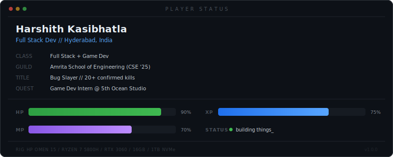

  

> 🕹️ Building full stack apps, games by night. Previously shipped core C++ gameplay for **ILAVATH: BATTLE ARENAS** at **5th Ocean Studio**.

### 🗡️ Skill Tree

**`💻 Languages`** &ensp;      

**`⚙️ Frameworks`** &ensp;     

**`🛠️ Dev Tools`** &ensp;    

## ⚔️ Projects

- 🤖 **[SearchTube](https://search-tube-cyan.vercel.app/)** — Distraction-free YouTube search with a clean dark UI
- 🍽️ **[Kanteen](https://github.com/onlikrsh/Calorie_tracker)** — Pre-order system that cut wait times for daily users, with real-time inventory tracking
- 🔥 **[Calorie Tracker](https://github.com/onlikrsh/REPO_NAME)** — Django-powered food diary + analytics dashboard

<!--
  📌 TO ADD A NEW PROJECT: Copy a line above and change the emoji, name, link, and description.
  Example:
  - 🎮 **[Project Name](https://github.com/onlikrsh/your-repo)** — What it does in one line
-->

---

  <code>the code compiles. the game runs. the quest continues.</code>

